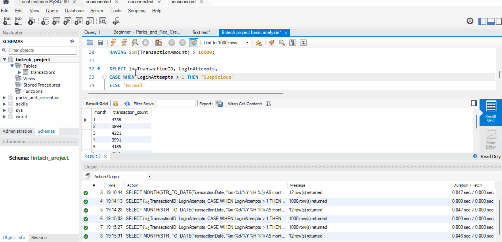

# Banking Transaction Analysis

Analyzed 50,000+ real banking transactions using SQL and Excel to identify fraud patterns, spending trends and customer behavior across demographics.

## Demo

## Tools Used
- MySQL Workbench (SQL)
- Microsoft Excel (Dashboard)
- Kaggle Dataset (50,000+ rows)

## Analysis Sections

### 1. Basic Analysis
- Total transaction count
- Debit vs Credit breakdown
- Average amount by channel (ATM vs Online)
- Top 5 locations by transaction volume

### 2. Customer Analysis
- Transaction count by occupation
- Average account balance by occupation
- Customers aged above average

### 3. Fraud Detection
- Flagged 18% of transactions as suspicious based on multiple login attempts
- Identified high value accounts exceeding RM10,000
- Flagged transactions above average amount

### 4. Date Analysis
- Monthly transaction trends
- Most recent transaction date
- 2023 transaction filter

## Key Findings
- Debit transactions account for 77% of total volume
- 18% of transactions flagged as suspicious
- Students make the most transactions across all occupations
- February recorded the lowest transaction volume
